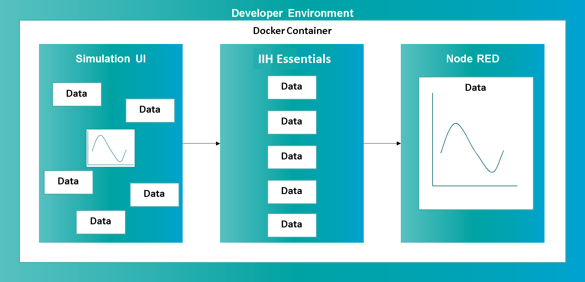

# IIH Essentials Development Kit Getting Started

Using the IIH Essentials Development Kit app you can develop your own apps based on the Data Service, test your app locally with simulated data to make sure your it behaves the same once you deploy your app to Industrial Edge.

- [IIH Essentials Development Kit Getting Started](#iih-essentials-development-kit-getting-started)
  - [Description](#description)
    - [Overview](#overview)
    - [General task](#general-task)
  - [Content](#content)
  - [Installation](#installation)
  - [Documentation](#documentation)
  - [Contribution](#contribution)
  - [Licence and Legal Information](#licence-and-legal-information)


## Description

### Overview

This application example introduces the Data Service Device Kit and how to extract data from the Data Service using the available API calls.
The free Development Kit provides you with a Docker Image that launches the Data Service API on the developer's computer and makes it callable. With this tool, you can develop your customer's app entirely without Industrial Edge access on your development computer. Nor do you need to own a real device that provides you with data. With our simulation service, plant data can be simulated without further ado.

Complete instructions for setting up the application example can be found in the [Installation](#installation)
- Starting the docker container
- After the docker container is started you can configure the parts of the application example using a web-browser:
  - Simulation UI
  - IIH Essentials (formerly called Data Service)
  - NodeRED


### General task

The simulation tool - provided by the Development Kit - generates a **Sinus Signal** and stores the data in the **Data Service** container. The Flow of the Node-Red applications accesses the **Data Service** via available API calls and displays the data in a dashboard.

  

## Content

To run the application example you have to download the Data Service Development Kit Getting Started

This GitHub-Repository contains:
- docs: Here you will find the [user documentation](./docs/Visualization_example_value.md) of the application example and more [implementation details](./docs/Implementation.md) to understand the way it works
- [NodeRed flow](./src/flows.json) for the visualization of the data
- [graphics](./docs/graphics) used in the documentation
- [docker-compose.yml](./docker-compose.yml): This file specifies which of the services run together, address, communication, etc.

> **_NOTE:_** The Docker images used no longer have to be loaded manually, but are automatically downloaded directly from github. (as specified in the [docker-compose.yml](./docker-compose.yml))

That file defines the use of the following images:

- IIH Essentials Development Kit for Industrial Edge V.1.8.0
- Data Simulator (dataservicesimulation:1.5.2)
- MQTT Broker (eclipse-mosquitto:1.6.10)
- Data Service (with external interface (REST API) for non-Siemens applications) (postgres:9.6.16-alpine)
- nodeRED (node-red:1.3.4)

## Installation

The following service must be installed:

- Docker for Linux
  
 > **_NOTE:_**  Linux device is used for this application example

### Start Docker Container

To start the Docker container, follow these steps:


1. Go to your device.
2. Open the console in the directory in which the application is to be stored
3. Clone the application example using the following command and then change the working directory:

   ```bash
   git clone <link of the git-repository>
   
   cd ./data-service-development-kit-getting-started
   ```


4. Start the containers by executing: 
```bash
   docker-compose up
   ```
   All service images are downloaded from Docker Hub and launched as defined in the "docker-compose.yml" file. 

   > **_Important:_**  The complete instructions for setting up the application example can be found in the [user documentation](docs/Visualization_example_value.md#description)

## Documentation

You can find the further information about the following steps in the [docs](./docs)

The contained two files may help to get the application example running and to understand the way it works:

- [Visualization of an example sinus in NodeRED (user documentation)](./docs/Visualization_example_value.md#description)

- [Production data extraction and visualization in NodeRED](./docs/Implementation.md#description)

## Contribution

Thank you for your interest in contributing. Anybody is free to report bugs, unclear documentation, and other problems regarding this repository in the Issues section.
Additionally everybody is free to propose any changes to this repository using Pull Requests.

If you haven't previously signed the [Siemens Contributor License Agreement](https://cla-assistant.io/industrial-edge/) (CLA), the system will automatically prompt you to do so when you submit your Pull Request. This can be conveniently done through the CLA Assistant's online platform. Once the CLA is signed, your Pull Request will automatically be cleared and made ready for merging if all other test stages succeed.

## Licence and Legal Information

Please read the [Legal information](LICENSE.md).
